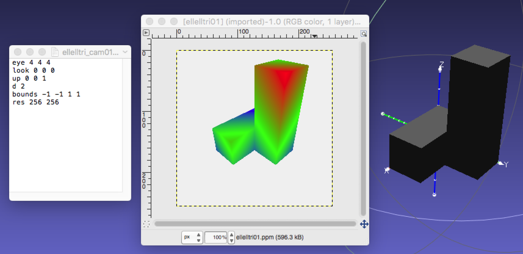

# Depth-Tracing
Project 3 for CS410 :: Producing a a pseudo-colored depth image in which
color indicates relative distance from the image plane.

## 1. Build Config.
   Typing 'make all' will build all classes. --> will produce the exe. 'raytracer'
   Typing 'make clean' will rm all object files and exe.

## 2. To Run
###  raytracer <camera model> <models.ply*> <output_file_name>

    * Camera model:
    * eye 4 4 4 
      look 0 0 0 
      up 0 0 1 
      d 2 
      bounds -1 -1 1 1 
      res 256 256 
    * <models.ply> : Polygonal model object files.
    * The Chainfile has this format:
    * <output_file_name> : Name of the image our program will write.

## 3. Example output

## 4. After Rendering scene with airplane object:
